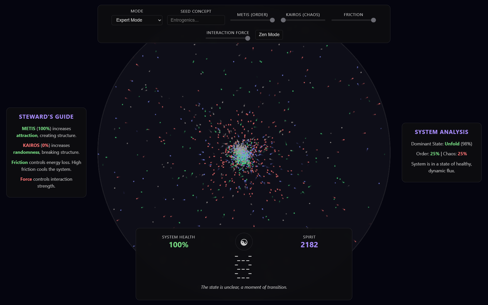

# Tohn 🧿 he/him

**Adaptive Systems Arkhitect** 🔮 

⚗️ I synthesize ethical simulations and coordination tools so communities can test ideas and scale what works 🎯

# -☯️- 

### Now building 🪄
- **[Entrogenics.com](https://entrogenics.com)** ~ researching the nature of adaptive systems
- **[SuperSomethingGames.com](https://supersomethinggames.com)** ~ flagship games and simulations project
- **[AddressAlarm.com](https://AddressAlarm.com)** ~ open, on-device safety notes for drivers and travelers  
- **[Custom GPT Wizard](https://github.com/TohnJravolta/Custom_GPT_Wizard)** ~ practical guides and tools for Custom GPT workflows
- **[ask.report](https://ask.report)** ~ entrogenics, patterns, models, and meta scale engines for coordination
- **[acid.quest](https://acid.quest)** ~ disolving reality into symbols and art-i-facts
- **IASIS.quest** ~ applied systems care: humane interfaces, rituals, and recovery patterns

### What I do ♻️
- Translate research into **reusable patterns** and **tiny protocols**  
- Prototype **ethical reality simulations** to explore options safely  
- Ship **docs, handoffs, and licenses** so work can outgrow me

### Featured projects ⛵

- ***Entrogenics*** → notes, models, and experiments behind the framework  
Site: https://entrogenics.com
   Repo: https://github.com/TohnJravolta/Entrogenics 🧿
  

- **Super Burst** → adaptive retro arcade with “warp reality” dodge-and-climb flow      
  Trailer: https://www.youtube.com/@supersomethinggames  
  Demo: https://supersomethinggames.com/super-burst-demo/

- **AddressAlarm** → AGPL, privacy-first Android app  
  Repo: https://github.com/TohnJravolta/AddressAlarm  
 
- **Custom_GPT_Wizard** → playbooks for building and improving Custom GPTs  
  Repo: https://github.com/TohnJravolta/Custom_GPT_Wizard  

### Principles 🧭
- **Commons first** ~ open licenses, clear credit, simple rules  
- **Small engines** ~ minimal tools that chain together  
- **Visible handoffs** ~ docs, checklists, and maintainer paths

### Open to co-creation 🦉
Issues and discussions are open. If you want to reuse anything, please do 🧬  
Credit upstream sources and pass it forward 🐬

#### The rising tide lifts all ships ⚕️
